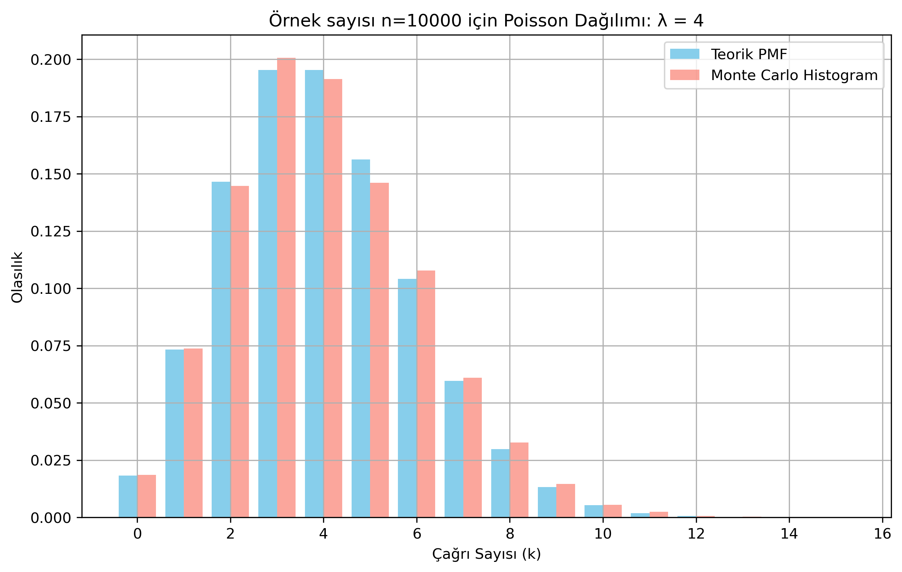

<h2>Poisson Dağılımı – Birim sürede gelen belirli sayıdaki çağrı sayısı ihtimalini hesaplama  ☎️</h2>

<p align="justify">Poisson dağılımı olasılık kütle fonksiyonu (pmf) şu şekilde tanımlanır:</p>

$$P(X=k) = \frac{e^{-\lambda} \lambda^k}{k!}$$

<h3>📝 Çağrı Merkezi Sorusu (Poisson Dağılım ve Olasılık Hesabı</h3>

<p align="justify">Bir çağrı merkezinde, ortalama olarak saatte λ=4 çağrı gelmektedir. Çağrıların gelişi Poisson dağılımına uymaktadır.
Buna göre bir saatte tam olarak k=6 çağrı gelme olasılığı nedir?</p>

<h3>Matematiksel Çözüm 🤔💭📊🧮📝</h3>

$$P(X=k) = \frac{e^{-\lambda} \lambda^k}{k!}$$

<p align="justify">λ=4 ve k=6 verilen değerlerini yerine koyarsak:</p>

$$P(X=6) = \frac{e^{-4} 4^6}{6!}$$

<p align="justify">Hesap makinesi kullanmak yerine aşağıdaki Python script ile hızlıca sonucu P(X=6) = 0.1042 buluruz.</p>

<b>poisson_distribution.py</b>

```
import math

# Parametreler
lambda_ = 4  # Ortalama çağrı sayısı
k = 6        # Belirli bir çağrı sayısı

# PMF formülü
pmf = (math.exp(-lambda_) * (lambda_ ** k)) / math.factorial(k)
print(f"Teorik Olasılık: P(X={k}) = {pmf:.4f}")
```

<p align="justify">Yani, bu çağrı merkezine bir saatte 6 çağrı gelme olasılığı yaklaşık %10.42'dir.</p>

<h3>Nümerik Çözüm 💻📊🧮</h3>

<p align="justify">Monte Carlo Simülasyonu Python kodu şöyle olabilir:</p>

<b>poisson_distribution_MCS.py</b>

```
import numpy as np

# Parametreler
lambda_ = 4
k = 6
num_trials = 10_000

# Poisson örnekleri üret
samples = np.random.poisson(lam=lambda_, size=num_trials)

# K = 6 olanları say
estimated_prob = np.sum(samples == k) / num_trials
print(f"Simülasyonla Yaklaşık Olasılık: P(X=6) = {estimated_prob:.4f}")
```

<p align="justify">Şimdi de Poisson dağılımının nasıl bir şeklinin olduğu anlamak için değişik k değerleri için grafik çizdirelim.</p>

<b>poisson_distribution_MCS_plots.py</b>

```
import numpy as np
import matplotlib.pyplot as plt
import math
from scipy.stats import poisson

# Parametreler
lambda_ = 4
num_trials = 10_000
max_k = 15  # Görselleştirme için k aralığı

# PMF değerleri (Teorik)
k_vals = np.arange(0, max_k + 1)
pmf_vals = poisson.pmf(k_vals, mu=lambda_)

# Monte Carlo simülasyonu
samples = np.random.poisson(lambda_, size=num_trials)
counts, bins = np.histogram(samples, bins=np.arange(0, max_k+2), density=True)

# Grafik
plt.figure(figsize=(10, 6))
plt.bar(k_vals-0.2, pmf_vals, width=0.4, label='Teorik PMF', color='skyblue')
plt.bar(k_vals+0.2, counts, width=0.4, label='Monte Carlo Histogram', color='salmon', alpha=0.7)

plt.xlabel("Çağrı Sayısı (k)")
plt.ylabel("Olasılık")
plt.title("Poisson Dağılımı: λ = 4")
plt.legend()
plt.grid(True)
plt.show()
```

<p align="justify">Yukarıdaki kodu koşturunca aşağıdaki örnek sonucu elde ederiz.</p>

