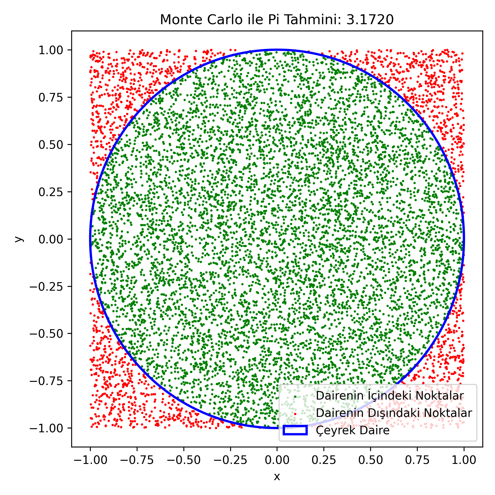

<h2>📝 Basit Bir Örnek: 𝞹 Sayısını Tahmin Etme</h2>

<p align="justify">Monte Carlo simülasyonunu daha iyi anlamak için klasik bir örnek olan 𝞹 sayısını tahmin etme problemini ele alalım:</p>

<h3>📐 Temel Fikir:</h3>
<ul>
    <li>Birim kare içine birim daire yerleştirilir.</li>
    <li>Kare içine rastgele noktalar atılır.</li>
    <li>Noktaların birim daire içine düşme oranı, 𝞹 sayısını tahmin etmemizi sağlar.</li>
</ul>

<h3>📊 Formül</h3>

$$\frac{\text{Birim daire iç​indeki noktalar}}{\text{Toplam noktalar}} \approx \frac{\pi}{4} \Rightarrow \pi \approx 4 \times \frac{\text{İçerideki noktalar}}{\text{Toplam noktalar}}$$

<h3>💻 Python Koduyla Örnek</h3>

<p align="justify">Aşağıdaki kodun koşturulmasını ve yorumunu izlemek için <a href="https://youtube.com">tıklayınız</a>.</p>

```
import numpy as np
import matplotlib.pyplot as plt

# Simülasyon için nokta sayısı
num_points = 10000

# [-1, 1] aralığında rastgele x ve y koordinatları üret
x = np.random.uniform(-1, 1, num_points)
y = np.random.uniform(-1, 1, num_points)

# Noktaların orijine olan mesafesi (r^2 = x^2 + y^2)
distances = x**2 + y**2

# Çeyrek daire içindeki noktaları belirle (r^2 <= 1)
inside_circle = distances <= 1

# Pi tahmini: 4 * (çeyrek daire içindeki noktalar / toplam noktalar)
pi_estimate = 4 * np.sum(inside_circle) / num_points

print(f"Tahmini Pi: {pi_estimate:.4f}")

# Noktaları görselleştir
plt.figure(figsize=(6,6))
plt.scatter(x[inside_circle], y[inside_circle], color='green', s=1, label='Dairenin İçindeki Noktalar')
plt.scatter(x[~inside_circle], y[~inside_circle], color='red', s=1, label='Dairenin Dışındaki Noktalar')
circle = plt.Circle((0, 0), 1, edgecolor='blue', fill=False, linewidth=2, label='Çeyrek Daire')
plt.gca().add_patch(circle)
plt.title(f"Monte Carlo ile Pi Tahmini: {pi_estimate:.4f}")
plt.xlabel("x")
plt.ylabel("y")
plt.axis('equal')
plt.legend()
plt.axis('tight')
plt.tight_layout()
plt.savefig("pi-estimation.png", dpi=300)
plt.show()
```

<h3>🧪 Kodun Çalışma Mantığı:</h3>
<ul>
    <li><b>n</b> kadar rastgele nokta üretilir.</li>
    <li>Her noktanın orijine uzaklığı hesaplanır.</li>
    <li>Uzaklığı 1 veya daha az olan noktalar dairenin içindedir.</li>
    <li>İçerideki nokta oranı ile 𝞹 tahmini yapılır.</li>
    <li>Görselde içteki noktalar yeşil, dıştaki noktalar kırmızı olarak gösterilir.</li>
</ul>



<h3>Referanslar</h3>
<p align="justify">[1] https://www.mehmetalikucuk.com/genel/kare-daire-olasilik-ve-pi-sayisi/</p>