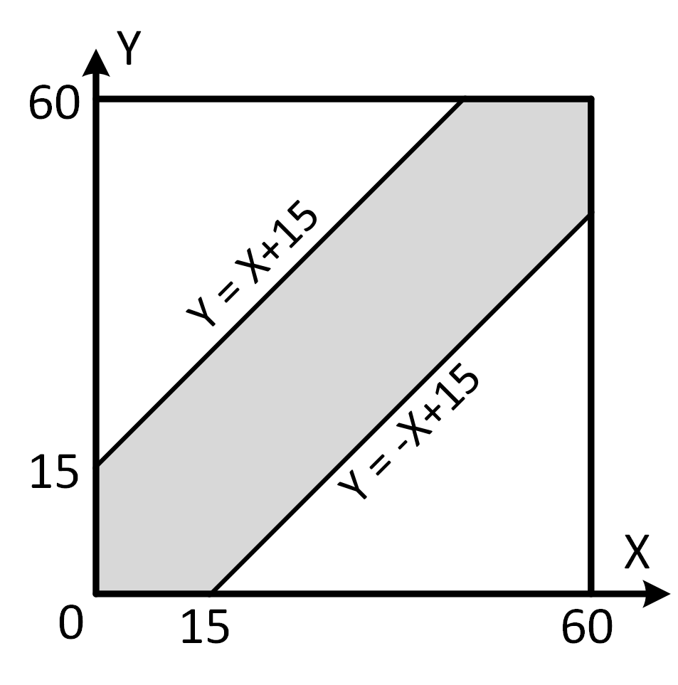
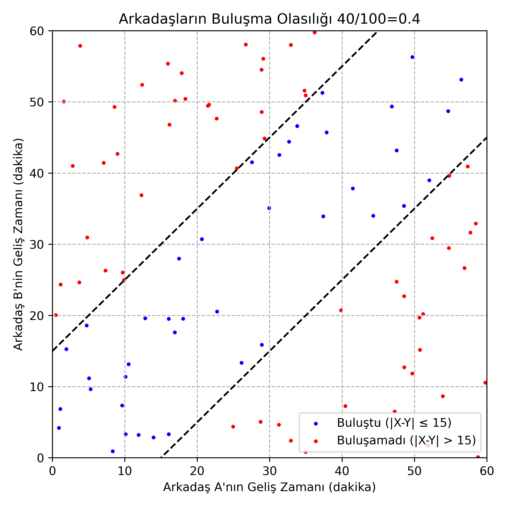
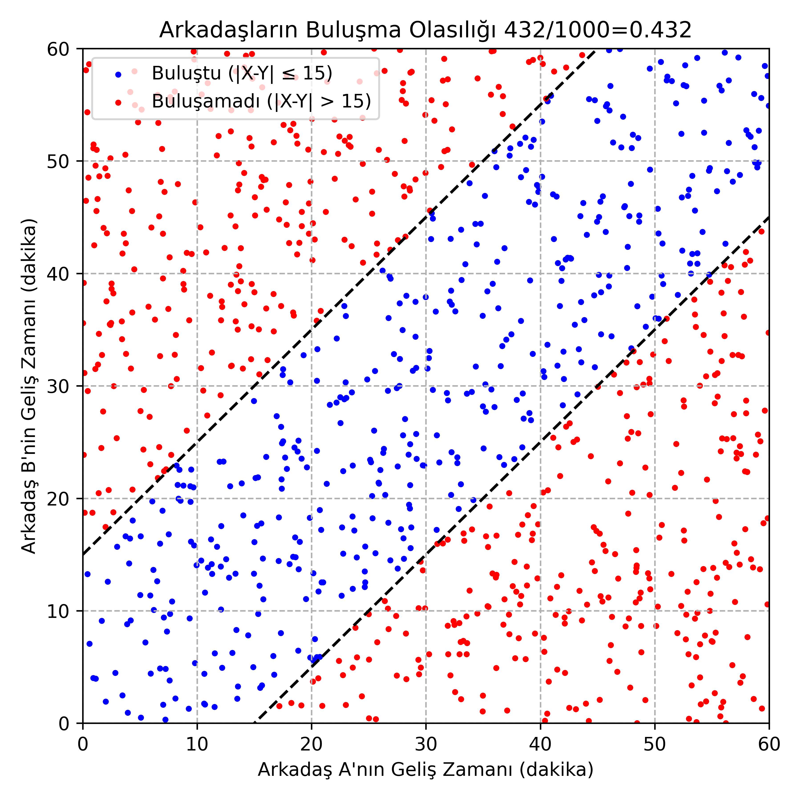
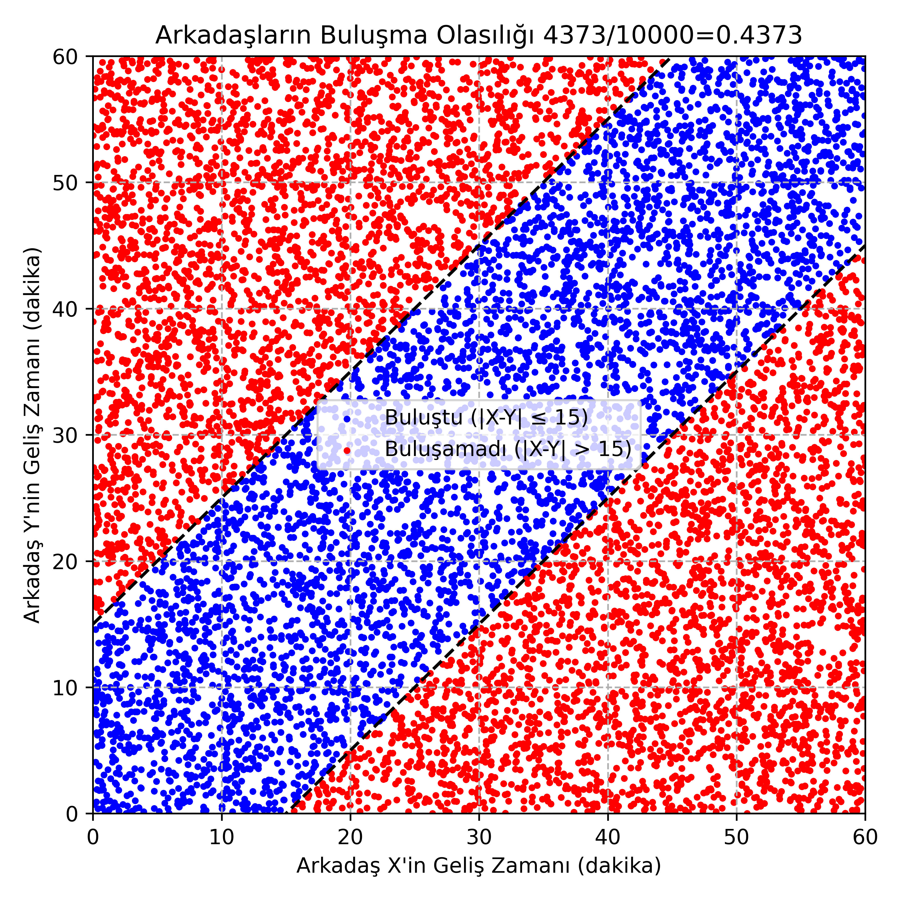

<h2>İki Arkadaşın Buluşma Olasılığı 🫂</h2>

<p align="justify">Monte Carlo simülasyonunu daha iyi anlamak için iki arkadaşın buluşma olasılığını hesapladığımız bir başka örneğe [1] bakalım:</p>

<b>Instructor 👨‍🏫</b>

<p align="justify">Selam ChatGPT!<br>İki arkadaş bir yerde 1 saatlik bir zaman penceresi içinde buluşacaklar. Yâni mesela 14:00-15:00 arasında şehir merkezinde buluşacaklar. Telefonları olmadığından haberleşemiyorlar. Daha önceden "buluşma yerine giden 15dk beklesin, öbürü gelmezse o zaman geri dönsün" diye sözleşmişler.<br>Bu problemi matematiksel olarak çözebilir miyiz?</p>

<b>ChatGPT 💻</b>

<p align="justify">Evet, bu problemi matematiksel olarak çözebiliriz!</p>

<h3>Matematiksel Çözüm 🤔💭📊🧮📝</h3>

<p align="justify">Arkadaşların geliş zamanlarını $X$ ve $Y$ olarak tanımlayalım.</p>

$$X,Y∼U(0,60)$$

<p align="justify">yâni her biri 0 ile 60 dakika arasında eşit olasılıkla herhangi bir zamanda gelebilir. İki arkadaşın buluşabilmesi için geliş zamanları arasındaki fark en fazla 15 dakika olmalıdır:</p>

$$ |X−Y|  \leq 15$$

<p align="justify">Bu, birim karede bir bölgenin alanını hesaplama problemine dönüşüyor.</p>

<h4>Geometrik Yorum</h4>

<p align="justify">İki arkadaşın geliş zamanlarını $(X,Y)$ olarak düşünelim. Bunlar birim karede</p>

$$[0,60]×[0,60]$$

<p align="justify">alanında tekdüze dağılım (uniform distribution) ile modellenen biçimde rastgele dağılım gösterir. Bu kare içinde, 

$$ |X−Y| \leq 15$$

<p align="justify">koşulunu sağlayan noktaların oluşturduğu bölgeyi inceleyelim. Mutlak değerden kurtulursak iki farklı doğru denklemi elde ederiz:</p>

$$X−Y=−15$$

<p align="justify">ve</p>

$$X−Y=15$$

<p align="justify">Bu doğrular üzerinde ve arasında olan bütün noktalar için buluşma gerçekleşir. Bu doğrular birbirine paralel olduğundan bunu bir bant gibi düşünebiliriz ve buluşma gerçekleşen noktalar bu bantın içinde yer alanlar olacaktır. Aşağıdaki grafikte bu bant gri renkle gösterilmiştir.</p>



<p align="justify">Gri alanın karenin alanına oranını hesaplarsak arkadaşların buluşma olasılığını bulmuş oluruz:</p>

$$P(M) = \frac{(60 \times 60) - (45 \times 45)}{60 \times 60} = 0.4375$$

<p align="justify">Burada $M$ harfi buluşma mânâsına gelen "meeting" kelimesinin yerine kullanılırken, $P$ ise olasılık mânâsına gelen "probability" yerine kullanılmıştır. Dolayısıyla $P(M)$ arkadaşların buluşma olasılığı anlamına gelmektedir.</p>

<b>Instructor 👨‍🏫</b>

<p align="justify">Peki bu iki arkadaşın buluşma olasılığını Python'da <b>numpy</b> ile rasgele sayı üreteci kullanarak, yâni Monte Carlo simülasyonu ile nasıl çözebilirim?</p>

<b>ChatGPT 💻</b>

<p align="justify">Selam! Bu problemi Monte Carlo simülasyonu ile de çözebilirsin. Ana fikri şöyle özetleyelim:</p>

<ul>
    <li>İki arkadaşın geliş zamanlarını (0 ile 60 dakika arasında) rastgele seç.</li>
    <li>Buluşma yeri için gelen kişi 15 dakika bekliyor.</li>
    <li>Eğer diğer kişi bu süre içinde gelirse buluşma gerçekleşiyor.</li>
    <li>Bunu binlerce kez simüle ederek buluşma olasılığını hesapla.</li>
</ul>

<p align="justify">Bunu <b>numpy</b> kullanarak şu şekilde kodlayabilirsin:</p>

<b>meeting.py</b>

```
import numpy as np

def bulusma_olasiligi(n_sim=10000):
    # Arkadaşların geliş zamanlarını (0-60 dk) rastgele seç
    arrival_A = np.random.uniform(0, 60, n_sim)
    arrival_B = np.random.uniform(0, 60, n_sim)

    # Mutlak farkları al ve 15 dakikadan küçük olanları say
    bulusanlar = np.abs(arrival_A - arrival_B) <= 15

    # Buluşma olasılığı
    return np.mean(bulusanlar)

# Simülasyonu çalıştır
bulusma_olasiligi()
```

<b>Intructor 👨‍🏫</b>

<p align="justify">Son olarak <b>matplotlib</b> kullanarak Monte Carlo simülasyonunu görselleştirebilir misin? Lütfen paralel olan iki doğruyu da göster.</p>

<b>ChatGPT 💻</b>

<p align="justify">Evet bunu kolayca yapabiliriz:</p>

<h3>Görsellik İçeren Kod 🌈</h3>

<p align="justify">Aşağıdaki kodun koşturulmasını ve yorumunu izlemek için <a href="https://www.youtube.com/watch?v=8aBywUP7tTM">tıklayınız</a>.</p>

<b>meeting_plot.py</b>

```
import numpy as np
import matplotlib.pyplot as plt

# Simülasyon için nokta sayısı
n_sim = 10000

# Rastgele geliş zamanları (0-60 dk)
arrival_A = np.random.uniform(0, 60, n_sim)
arrival_B = np.random.uniform(0, 60, n_sim)

# Buluşma sağlanan noktalar (mavi) ve sağlanamayanlar (kırmızı)
meet_condition = np.abs(arrival_A - arrival_B) <= 15

# Grafiği çiz
plt.figure(figsize=(6,6))
plt.scatter(arrival_A[meet_condition], arrival_B[meet_condition], color='blue', s=5, label="Buluştu (|X-Y| ≤ 15)")
plt.scatter(arrival_A[~meet_condition], arrival_B[~meet_condition], color='red', s=5, label="Buluşamadı (|X-Y| > 15)")

# Paralel doğrular
x = np.linspace(0, 60, 100)
plt.plot(x, x + 15, 'k--')  # Üst sınır: Y = X + 15
plt.plot(x, x - 15, 'k--')  # Alt sınır: Y = X - 15

# Eksenler ve ayarlar
plt.xlim(0, 60)
plt.ylim(0, 60)
plt.xlabel("Arkadaş A'nın Geliş Zamanı (dakika)")
plt.ylabel("Arkadaş B'nin Geliş Zamanı (dakika)")
plt.title(f"Arkadaşların Buluşma Olasılığı {sum(meet_condition)}/{n_sim}={np.mean(meet_condition)}") # sum(meet_condition)/n_sim
plt.legend()
plt.grid(True, linestyle='--')
plt.tight_layout()
plt.savefig(f"meeting_plot_n_{n_sim}.png", dpi=600)
plt.show()
```

<p align="justify">Aşağıda kodun bazı örnek çıktılarını görebilirsiniz.</p>

| n=100 | n = 1000 | n=10000 |
| :--:  | :--:  | :--:  |
|  |  |  |

<h3>Referanslar</h3>
<p align="justify">[1] https://www.youtube.com/watch?v=Tkf9CnvS3i0</p>