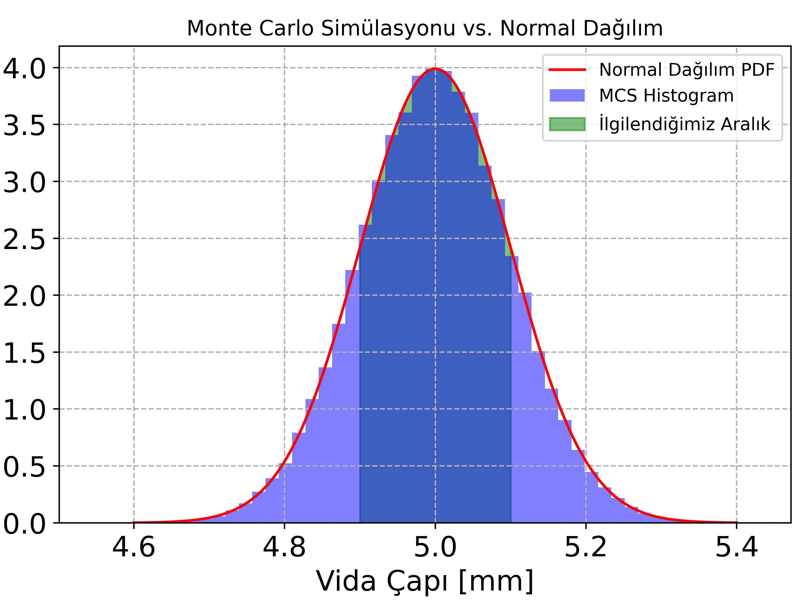

<h2>Fabrikada Üretilen Vidaların Müşteri Tarafından Kabul Edilebilme Olasılığı 🔩</h2>

<p align="justify"><b>👨‍🏫 Instructor</b><br>Selam ChatGPT,<br>
Bugüne kadar Monte Carlo simülasyonları yaparken <b>numpy</b> paketinin <b>random</b> sınıfından <b><i>uniform()</i></b> ve <i></b>shuffle()</i></b> isimli fonksiyonlarını kullandık. Matematiksel çözümü elde edilebilen (belki Normal dağılım tablosu yardımıyla) ama aynı zamanda normal dağılım fonksiyonu kullanarak Monte Carlo simülasyonuyla da cevabı bulunabilen bir olasılık/istatistik sorusu bana örnek verebilir misin?</p>

<p align="justify"><b>💻 ChatGPT</b><br>Selam! Güzel bir soru. Aşağıda, hem matematiksel olarak çözülebilen hem de normal dağılım kullanarak Monte Carlo simülasyonu ile yaklaşık olarak bulunabilen bir olasılık sorusu veriyorum:</p>

<p align="justify"><b>📝 Soru:</b> Bir fabrika, ürettiği vidaların 🔩 çaplarının $N(\mu, \sigma^2) = N(5, 0.12)$ (yani ortalama 5mm, standart sapma 0.1mm olan normal dağılım) ile dağıldığını iddia etmektedir. Bir müşteri, çapı 4.9mm ile 5.1mm arasında olan vidaların kabul edilebilir olduğunu belirtmiştir. Buna göre fabrika tarafından üretilen vidaların müşteri tarafından kabul edilebilir olma olasılığı nedir?</p>

<h3>Matematiksel Çözüm 🤔💭📊🧮📝</h3>

<p align="justify">Vidaların çapı</p>

$$X \sim N(5,0.12)$$ 

<p align="justify">dağılımıyla modellendiği için, standart normal değişkene dönüştürelim:</p>

$$P(4.9 \leq X \leq 5.1) = P\left(\frac{4.9 - 5}{0.1} \leq Z \leq \frac{5.1 - 5}{0.1} \right)$$

$$= P(-1 \leq Z \leq 1)$$

<p align="justify">Bu değerleri standart normal dağılım tablosundan faydalanarak</p>

$$P(Z \leq 1) \approx 0.8413$$

<p align="justify">ve</p>

$$\quad P(Z \leq -1) \approx 0.1587$$

<p align="justify">olarak buluruz. Buradan da uygun işlemle olasılığı</p>

$$P(-1 \leq Z \leq 1) = 0.8413 - 0.1587 = 0.6826$$

<p align="justify">olarak hesaplarız. Yâni, rastgele seçilen bir vidanın kabul edilebilir olma olasılığı yaklaşık olarak %68.26'dır.

<h3>Nümerik Çözüm 💻📊🧮</h3>

<p align="justify">Yukarıda gördüğümüz matematiksel çözüm zor değil ama aramızda istatistik bilgilerini hatırlamayanlar veya hiç bilmeyenler olabilir. Bu durumda bu problemi <b>NumPy</b> kullanarak <b>Monte Carlo Simülasyonu</b> ile de çözebiliriz. Aşağıdaki adımları takip edelim.</p>

<ol>
    <li>Normal dağılımdan çok sayıda (örneğin 100,000) rastgele vida çapı üret.</li>
    <li>Çapı 4.9 ile 5.1 arasında olan vidaları say.</li>
    <li>Oranı hesapla.</li>
</ol>

<p align="justify">Bunu yapan Python kodu şöyle olabilir:</p>

<b>acceptable_screws.py</b>

```
import numpy as np

# Monte Carlo simülasyonu
num_samples = 100000  # Örnek sayısı
vidalar = np.random.normal(loc=5, scale=0.1, size=num_samples)

# Kabul edilen vidaların oranını hesapla
kabul_edilen = np.sum((vidalar >= 4.9) & (vidalar <= 5.1)) / num_samples

print(f"Kabul edilen vida oranı: {kabul_edilen:.4f}")
```

<p align="justify">Burada grafiksel olarak da birşeyler yapalım. Bunun için her zaman olduğu gibi <b>matplotlib</b> paketini kullanacağız. Aşağıdaki adımları uygulayalım.</p>

<ol>
    <li>Dağılımı tasvir eden olasılık yoğunluk fonksiyonunun (probability density function - PDF) grafiğini teorik olarak çizdirelim.</li>
    <li>Monte Carlo Simülasyonu tarafından üretilen örnekleri bir histogram olarak çizdirelim.</li>
    <li>Kabul edilebilir vida aralığı olan [4.9,5.1] aralığındaki vidaları gölgelendirerek görselleştirelim.</li>
</ol>

<p align="justify">Bunu yapan Python kodu şöyle olabilir:</p>

<b>acceptable_screws_distribution.py</b>

```
import numpy as np
import matplotlib.pyplot as plt
import scipy.stats as stats

# Parameters of the normal distribution
mu = 5       # Mean
sigma = 0.1  # Standard deviation
num_samples = 100000  # Monte Carlo sample size

# Generate Monte Carlo samples
samples = np.random.normal(mu, sigma, num_samples)

# Plot histogram of the Monte Carlo samples
plt.hist(samples, bins=50, density=True, alpha=0.5, label="Monte Carlo Samples", color="blue")

# Generate x values for the normal distribution curve
x = np.linspace(mu - 4*sigma, mu + 4*sigma, 1000)
pdf = stats.norm.pdf(x, mu, sigma)  # Probability Density Function

# Plot the normal distribution curve
plt.plot(x, pdf, 'r-', label="Normal Distribution PDF")

# Shade the acceptable region (4.9 to 5.1)
x_shade = np.linspace(4.9, 5.1, 100)
pdf_shade = stats.norm.pdf(x_shade, mu, sigma)
plt.fill_between(x_shade, pdf_shade, color='green', alpha=0.5, label="Acceptable Region")

# Labels and title
plt.xlabel("Screw Diameter [mm]")
plt.ylabel("Probability Density")
plt.title("Monte Carlo Simulation vs. Normal Distribution")
plt.legend()
plt.grid()

# Show the plot
plt.show()
```



<h3>🔍 Grafiğin Açıklaması</h3>

<ol>
    <li>Kırmızı çizgi N(5,0.12) dağılımını temsil etmekte.</li>
    <li>Mavi histogram Monte Carlo Simülasyonu tarafından üretilen örneklerden oluşturuldu.</li>
    <li>Yeşille gösterilen bölge bizim hem matematiksel hem nümerik olarak yaklaşık 0.6826 hesapladığımız [4.9,5.1] aralığına düşen vidaları göstermekte.</li>
</ol>

