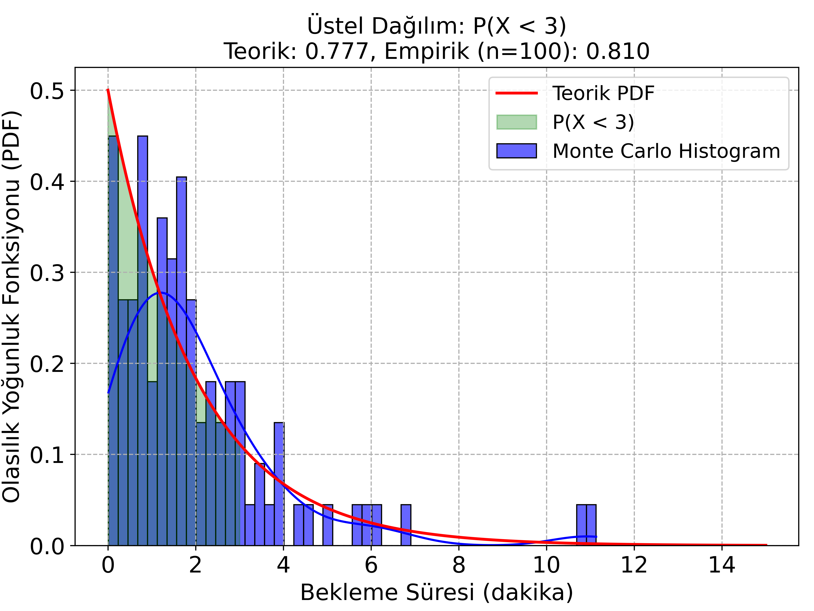
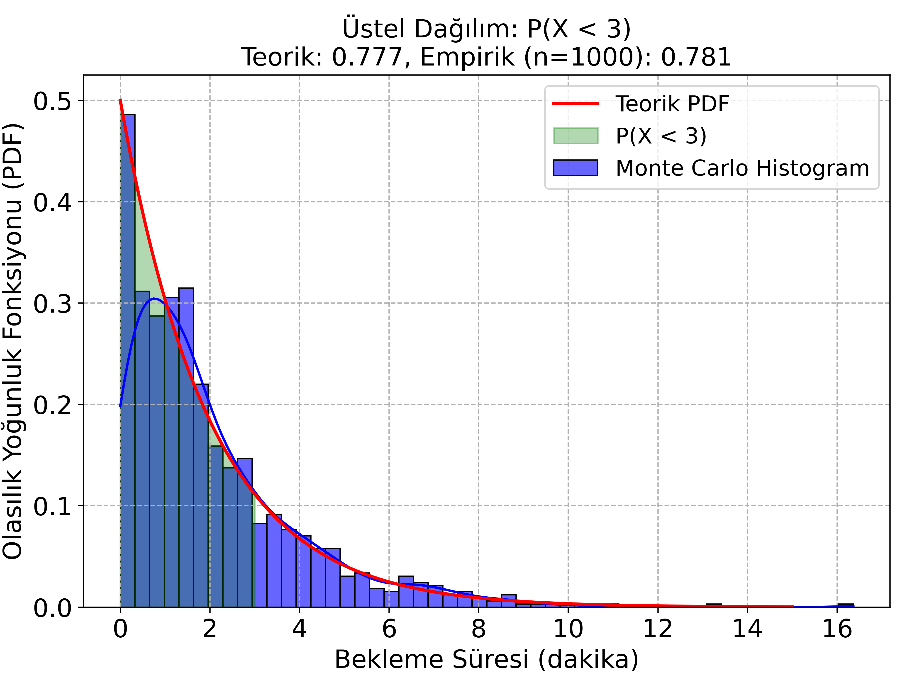
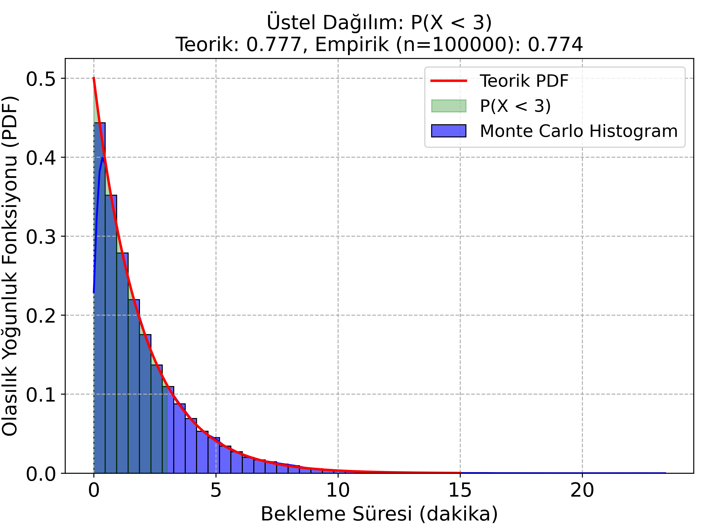

<h2>Ä°ki ÇaÄŸrı Arasında Bekleme Süresinin Olasılık Hesabı  â˜ï¸</h2>

<p align="justify"><b>👨â€ğŸ« Instructor</b><br>Selam ChatGPT,<br>
Bugüne kadar Monte Carlo simülasyonları yaparken <b>numpy</b> paketinin <b>random</b> sınıfından <b><i>uniform()</i></b> ve <i></b>shuffle()</i></b> isimli fonksiyonlarını kullandık. Geçen hafta da matematiksel çözümü elde edilebilen (belki Normal dağılım tablosu yardımıyla) ama aynı zamanda normal dağılım fonksiyonu kullanarak Monte Carlo simülasyonuyla da cevabı bulunabilen bir olasılık/istatistik sorusuna baktık. Bu hafta da üstel dağılım (expontial distribution) olarak bilinen dağılma benzer bir örnek verebilir misin?</p>

<p align="justify"><b>💻 ChatGPT</b><br>Selam! Bir çağrı merkezinde müşteri hizmetlerine gelen çağrılar arasındaki süre üstel dağılıma çok uygun bir örnektir. Üstel dağılımın olasılık yoğunluk fonksiyonu (pdf) şu şekilde tanımlanır:</p>

$$f(x) = \lambda e^{-\lambda x}$$

<p align="justify">Burada:</p>
<ul>
    <li>λ dağılımın oran parametresidir (yâni birim zamanda, mesela 1 dakikada, ortalama kaç çağrı geldiğini ifade eder).</li>
    <li>x ise bekleme süresidir (rastgele değişken).</li>
</ul>

<p align="justify">Oran parametresi λ'yı daha iyi anlayalım.</p>

<ul>
    <li>Eğer λ=2 ise, bu bir dakikada ortalama 2 çağrı geldiğini gösterir.</li>
    <li>Eğer λ=5 olsaydı, bir dakikada ortalama 5 çağrı geldiğini ifade ederdi.</li>
</ul>

<p align="justify">Üstel dağılımın olaylar arasındaki bekleme süresini modellediğini unutmayalım. Yani burada X, iki çağrı arasındaki süreyi (örneğin, bir çağrı geldikten sonra sonraki çağrıya kadar geçen süreyi) temsil ediyor.</p>

<p align="justify">Bu durumda, $P(X<3)$ ifadesi "Çağrılar arasındaki sürenin 3 dakikadan kısa olma olasılığı" manasına gelir. Yâni, "bir çağrıdan sonra 3 dakika içinde yeni bir çağrı gelme olasılığı" olarak yorumlanır.</p>

<p align="justify">Özet olarak:</p>
<ul>
    <li>λ büyükse → Çağrılar daha sık geliyor, bekleme süresi daha kısa.</li>
    <li>λ küçükse → Çağrılar daha seyrek geliyor, bekleme süresi daha uzun.</li>
</ul>

<p align="justify">Yani, λ çağrı sıklığını belirleyen bir parametredir. Bu ön bilgiden sonra sorumuza geçelim.</p>


<h3>📠Çağrı Merkezi Sorusu (Üstel Dağılım ve Olasılık Hesabı (λ=0.5)</h3>

<p align="justify">Bir çağrı merkezine gelen çağrılar üstel dağılıma göre dağılmaktadır. Çağrıların geliş oranı λ=0.5 çağrı/dakika olarak bilinmektedir. Buna göre, bir çağrıyı yanıtladıktan sonra sonraki çağrının gelme süresinin 3 dakikadan kısa olma olasılığını hesaplayınız.</p>

<h3>Matematiksel Çözüm 🤔💭📊🧮ğŸ“</h3>

<p align="justify">Yâni, $P(X<3)$ olasılığını hesaplamamız gerekiyor. Üstel dağılımın kümülatif dağılım fonksiyonu (CDF):</p>

$$P(X<x) = 1−e^{-\lambda x}$$

<p align="justify">verilen deÄŸerleri yerine koyarsak:</p>

$$P(X<3) = 1−e^{−\frac{1}{2}3}$$

$$P(X<3) = 1−e^{−1.5}$$

$$P(X<3) \approx 1−0.2231$$

$$P(X<3) \approx 0.7769$$

<p align="justify">Yani, bu çağrı merkezinde bir çağrı geldikten sonra 3 dakika içinde yeni bir çağrının gelme olasılığı yaklaşık %77.69'dur.</p>

<h3>Nümerik Çözüm 💻📊🧮</h3>

<p align="justify">Monte Carlo Simülasyonu Python kodu şöyle olabilir:</p>

<b>phone_call_wait_time.py</b>

```
import numpy as np
import matplotlib.pyplot as plt
import seaborn as sns
from scipy.integrate import quad

# Üstel dağılım fonksiyonları
def exponential_pdf(x, lambd):
    return lambd * np.exp(-lambd * x)

def exponential_cdf(x, lambd):
    return 1 - np.exp(-lambd * x)

# Parametreler
lambd = 0.5  # Lambda (oran parametresi)
n = 10000  # Örnek büyüklüğü
x_vals = np.linspace(0, 15, 1000)  # PDF için x ekseni
x_fill = np.linspace(0, 3, 1000)  # Gölgelenecek alan

# Monte Carlo Simülasyonu
samples = np.random.exponential(scale=1/lambd, size=n)

# Teorik ve Empirik Olasılık Hesaplama
P_X_less_3_theoretical = exponential_cdf(3, lambd)
P_X_less_3_empirical = np.mean(samples < 3)

# Histogram ve PDF çizimi
plt.figure(figsize=(8, 6))
sns.histplot(samples, bins=50, kde=True, stat='density', color='b', alpha=0.6, label='Monte Carlo Histogram')
plt.plot(x_vals, exponential_pdf(x_vals, lambd), 'r', lw=2, label='Teorik PDF')
plt.fill_between(x_fill, exponential_pdf(x_fill, lambd), alpha=0.3, color='g', label='P(X < 3)')
plt.xlabel('Bekleme Süresi (dakika)', fontsize=16)
plt.ylabel('Olasılık Yoğunluk Fonksiyonu (PDF)', fontsize=16)
plt.title(f'Üstel Dağılım: P(X < 3)\nTeorik: {P_X_less_3_theoretical:.3f}, Empirik (n=10000): {P_X_less_3_empirical:.3f}', fontsize=16)
plt.grid(True, linestyle='--')
plt.tight_layout()
# plt.subplots_adjust(left=0.11)  # Increase left margin specifically
plt.xticks(fontsize=16)  # Makes x-axis numbers bigger
plt.yticks(fontsize=16)  # Makes y-axis numbers bigger
plt.legend(fontsize=14)
plt.savefig(f"phone_call_wait_time_{n}.png", dpi=500)
plt.show()

# Matematiksel Olasılık Hesabı (Integral ile Doğrulama)
def exponential_integral(x, lambd):
    return quad(lambda t: lambd * np.exp(-lambd * t), 0, x)[0]

theoretical_integral = exponential_integral(3, lambd)
print(f"Teorik P(X < 3) (integral ile hesaplanan): {theoretical_integral:.3f}")
```

<p align="justify">Geçen hafta normal dağılım için Monte Carlo Simülasyonu yaparken <b>scipy</b> kullanılmıştı ki bu hafta yine kullanılmış. Ancak grafiksel olarak dağılımın (yâni olasılık yoğunluk fonksiyonunun) grafiğini çizdirmek için her zaman kullandığımız <b>matplotlib</b> paketinin yanında bu sefer <b>seaborn</b> isimli paket de kullanılmış. Eğer bu paket bizde yüklü değilse</p>

```
pip install seaborn
```

<p align="justify">komutuyla yükleyip yukarıdaki kodu koşturabiliriz. Farklı örnek sayıları için kodu koşturursak aşağıdaki sonuçları elde ederiz.</p>


| n = 100 | n=1,000 |
| :--: | :--: |
|  |  |

| n = 10,000 | n=100,000 |
| :--: | :--: |
|  |  |